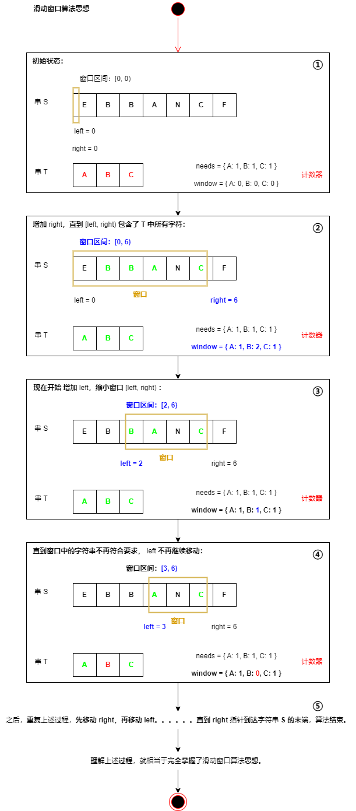

Day09.滑动窗口算法框架

# 零、前言

## 1.滑动窗口算法-大致逻辑/思路：

- 维护一个窗口，**不断滑动**，然后**更新答案**。

```js
let left = 0,
  right = 0

// right < s.size()
while (right < s.length) {
  // 增大窗口
  window.add(s[right])
  right++

  while(window needs shrink) {
    // 缩小窗口
    window.remove(s[left])
    left++
  }
}
```

## 2.滑动窗口算法-时间复杂度 O(N)

- 滑动窗口算法时间复杂度 O(N)，
- **比**字符串**暴力算法**要**高效**得多。

## 3.滑动窗口算法-的困扰：

不是算法的思路，而是各种**细节问题**：

1. 如何向窗口中添加新元素，
2. 如何缩小窗口，
3. 在窗口滑动的哪个阶段更新结果。

即使明白了细节，也容易出 bug，找 bug 还不知道怎么找。

## ⭐4.重点在于算法思想，把框架思维了然于心

- **算法主要看时间复杂度**，能确保自己的时间复杂度最优就行了。
- LeetCode 所谓的运行速度，都是玄学，不是慢的离谱就没啥问题，不值得从编译层面优化，不要舍本逐末。
- **重点在于算法思想**，把框架思维了然于心，然后随便魔改代码，开心就好。

## 5.原文讲解思路

1. 76 讲原理，其他 567/438/3 闭眼秒杀。

2. 滑动窗口很多时候处理字符串相关的问题，Java 处理字符串不方便，这里用 C++ 实现。

### 5.1.简单介绍要用的数据结构

1. 简单介绍一下一些用到的数据结构，以免因为语言细节问题阻碍对算法思想的理解。

2. `unordered_map` ：哈希表（字典），相当于 Java 的 `HashMap`，它的一个方法 `count(key)` 相当于 Java 的 `containsKey(key)` 可以判断键 key 是否存在。

3. 可以使用 方括号访问键对应的值 map[key] 。

4. 注意： key 不存在，c++ 自动创建这个 key，并把 `map[key]` 赋值为 0 。所以代码中多次出现的 `map[key]++` 相当于 Java 的 `map.put(key, map.getOrDefault(key, 0) + 1)` 。

5. 另外，Java 中的 Integer 和 String 这种包装类不能直接用 == 进行相等判断，而应该使用类的 equals 方法，这个语言特性有点坑，会具体提示。

## ⭐6.滑动窗口算法-思想：

1. **字符串 S** 中使用双指针的**左右指针技巧**，初始化 `left = right = 0`，把索引的**左闭右开**区间 `[left,right)` 称为一个「**窗口**」。
2. 先**不断**增加 right 指针**扩大窗口** `[left, right)`（也就是 `right++`），**直到**窗口中的字符串**符合要求**：包含 T 中所有字符。
3. 停止增加 right ，转而**不断**增加 left 指针**缩小窗口** `[left, right)`（也就是 `left++`），**直到**窗口中的字符串**不再符合要求**：不包含 T 中所有字符。
4. 同时，**每增加 left**，都要**更新一轮结果**。
5. **重复 2 & 3** 步骤，**直到 right** 到达字符串 S 的**尽头**。
6. 第 2 步骤**寻找**「可行解」（符合要求），第 3 步骤**优化**「可行解」（找最短），最终找到「**最优解**」（最短的覆盖子串）。
7. 左右指针轮流前进，窗口大小增增减减，窗口不断向右滑动，这就是「滑动窗口」名字的来历。

### 6.1.注意：左闭右开，最方便处理：

【1】可以设计两端都开，或者两端都闭的区间，但**设计左闭右开区间，最方便处理**。

【2】因为在初始化 `left = right = 0` 时：

1. 「左闭右开」区间：初始区间 `[0, 0)` 中没有元素，只要 right 右移（扩大）一位，区间 `[0, 1)` 就包含一个元素 0 了；
2. 「两端都开」区间：right 右移一位，`(0, 1)` 仍然没有元素；
3. 「两端都闭」区间：初始区间 `[0, 0]` 已经包含一个元素。

【3】**后两者区间**，都会给**边界处理**带来不必要的麻烦。

## ⭐7.滑动窗口算法-框架代码（js 版，包含 debug）

两处 【...】 表示：

1. 更新窗口数据，**直接填**；
2. 分别是扩大和缩小窗口的更新操作，**完全对称**。

```js
/**
 * 滑动窗口算法框架：js 版
 *
 * @param {string} s
 * @param {string} t
 * @return {undefined/number/number[]/boolean}
 */
function slidingWindow(s, t) {
  // 【首先】，初始化 window 和 need 两个哈希表，记录窗口中的字符和需要凑齐的字符：
  let need = new Map(),
    window = new Map();

  for (let i = 0; i < t.length; i++) {
    let c = t[i];
    // 默认为 0，计数存在几次：
    !need.has(c) ? need.set(c, 1) : need.set(c, need.get(c) + 1);
  }

  // 【然后】，使用 left 和 right 变量初始化窗口的两端，不要忘了，区间 [left, right) 左闭右开，所以初始情况下窗口没有包含任何元素：
  let left = 0,
    right = 0;
  let valid = 0;
  while (right < s.length) {
    // 【开始滑动】
    // c 是将移入窗口的字符
    let c = s[right];
    // 增大窗口
    right++;
    // 进行窗口内数据的一系列更新
    【...】

    /*** debug 输出的位置 ***/
    console.log("window: [%d,%d)\n", left, right)
    /***********************/
    // 判断左侧窗口是否要收缩
    while (window needs shrink) {
      // d 是将移出窗口的字符
      let d = s[left];
      // 缩小窗口
      left++;
      // 进行窗口内数据的一系列更新
      【...】
    }
  }
}
```

## ⭐8.画图理解

见例题：76. 最小覆盖子串

## ⭐9.框架使用方法

> 1. **默写**滑动窗口框架
> 2. 套模板，**思考并回答 4 个问题**。

见例题：76. 最小覆盖子串

# 一、最小覆盖子串（76. 最小覆盖子串）

> [76. 最小覆盖子串](https://leetcode.cn/problems/minimum-window-substring/description/)  
> 困难

## 1.读懂题目：

字符串 s 和 t
返回 s 中涵盖 t 中所有 字符的最小子串，
s 中不存在涵盖 t 所有字符的子串，则返回空字符串""

## 2.写出思路：

### 1）暴力解法，算法时间复杂度 O(N^2)，不好：

```c++
for(int i = 0; i < s.size(); i++)
  for (int j = i + 1; j < s.size(); j++)
    if s[i:j] 包含 t 的所有字母：
        更新答案
```

### ⭐2）滑动窗口算法-画图理解

> 根据滑动窗口算法思想，画图理解。

needs 和 window 相当于计数器，分别记录 T 中字符出现次数和「窗口」中的相应字符的出现次数。



### ⭐3）滑动窗口算法-使用框架

#### 【首先】，

- 初始化 window 和 need 两个哈希表，记录窗口中的字符和需要凑齐的字符：`window`、`need`、for 循环。

C++

```c++
unordered_map<char, int> need, window;
for (char c : t) need[c]++;
```

JavaScript

```js
// 【首先】，初始化 window 和 need 两个哈希表，记录窗口中的字符和需要凑齐的字符：
let need = new Map(),
  window = new Map()

for (let i = 0; i < t.length; i++) {
  let c = t[i]
  // 默认为 0，计数存在几次：
  !need.has(c) ? need.set(c, 1) : need.set(c, need.get(c) + 1)
}
```

#### 【然后】，

- 使用 left 和 right 变量初始化窗口的两端，不要忘了，区间 `[left, right)` 左闭右开，所以初始情况下窗口没有包含任何元素：

C++

```c++
int left = 0, right = 0;
int valid = 0;
while (right < s.size()) {
    // 开始滑动
}
```

JavaScript

```js
// 【然后】，使用 left 和 right 变量初始化窗口的两端，不要忘了，区间 [left, right) 左闭右开，所以初始情况下窗口没有包含任何元素：
let left = 0,
  right = 0

let valid = 0

let start = 0,
  len = Number.MAX_SAFE_INTEGER //最大安全整数。

while (right < s.length) {
  // 【开始滑动】
}
```

#### 【开始滑动】，

- `while (right < s.length) {}`

#### 【其中】，

- `valid` 变量表示窗口中满足 `need` 条件的字符个数，
- 如果 `valid` 和 `need.size` 的大小相同，则说明窗口已满足条件，已经完全覆盖了串 T。

```c++
// 判断左侧窗口是否要收缩
while (valid == need.size()) {
}
```

```js
while (valid == need.size) {}
```

#### ⭐【开始套模板】，

【1】**先思考** 4 个问题：

1. 移动 `right` **扩大窗口**（加入字符时），应该**更新哪些数据？**

2. **什么条件**下，窗口应该**暂停扩大**，开始移动 `left` **缩小窗口？**

3. 当移动 `left` **缩小窗口**（移出字符时），应该**更新哪些数据？**

4. **期望结果**应该在**扩大**窗口时**还是缩小窗口时更新？**

也就是，先思考：

1. 扩大窗口，更新什么数据？
2. 什么时候 暂停扩大，开始缩小窗口？
3. 缩小窗口，更新什么数据？
4. 期望结果是扩大还是缩小窗口时更新？

【2】**再回答** 4 个问题：

1. 如果一个字符进入窗口，应该增加 window 计数器；
2. 如果一个字符将移出窗口的时候，应该减少 window 计数器；
3. 当 valid 满足 need 时应该收缩窗口；
4. 应该在收缩窗口的时候更新最终结果。

也就是，再回答：

1. 字符进入窗口，增加 window 计数器。
2. valid 满足 need，开始缩小窗口。
3. 字符移出窗口，减少 window 计数器。
4. 缩小窗口更新期望结果。

### ⭐4）滑动窗口算法-总结使用：

> 1. **默写**滑动窗口框架
> 2. 套模板，**思考并回答 4 个问题**。

## 3.代码实现： minWindow

```js
/**
 * @param {string} s
 * @param {string} t
 * @return {string}
 */
var minWindow = function (s, t) {
  let need = new Map(),
    window = new Map()

  for (let i = 0; i < t.length; i++) {
    let c = t[i]
    !need.has(c) ? need.set(c, 1) : need.set(c, need.get(c) + 1)
  }
  let left = 0,
    right = 0

  let valid = 0

  let start = 0,
    len = Number.MAX_SAFE_INTEGER //最大安全整数。

  while (right < s.length) {
    let c = s[right]
    right++
    if (need.has(c)) {
      !window.has(c) ? window.set(c, 1) : window.set(c, window.get(c) + 1)
      if (window.get(c) === need.get(c)) {
        valid++
      }
    }

    while (valid == need.size) {
      if (right - left < len) {
        start = left
        len = right - left
      }

      let d = s[left]
      left++

      if (need.has(d)) {
        if (window.get(d) === need.get(d)) {
          valid--
        }
        window.set(d, window.get(d) - 1)
      }
    }
  }
  // console.log(74, start, len);
  return len === Number.MAX_SAFE_INTEGER ? '' : s.substring(start, start + len)
}
```

## 4.测试用例：

```js
let s = 'ADOBECODEBANC',
  t = 'ABC',
  s2 = 'a',
  t2 = 'a',
  s3 = 'a',
  t3 = 'aa'
let res1 = minWindow(s, t),
  res2 = minWindow(s2, t2),
  res3 = minWindow(s3, t3)
console.log(res1, '-', res2, '-', res3)
```

# 二、字符串排列（567. 字符串的排列）

> [567. 字符串的排列](https://leetcode.cn/problems/permutation-in-string/description/)  
> 中等

## 1.读懂题目：

字符串 s1 和 s2，写一个函数判断 s2 是否包含 s1 的排列。
是 返 true；否则 返 false。
s1 的排列之一是 s2 的子串。

## 2.写出思路：

> 根据滑动窗口算法思想，以及滑动窗口算法框架，思考&回答 4 个问题

### s1 可以包含重复字符，所以题难度不小。

明显的滑动窗口算法，相当于给你一个 S 和一个 T，请问 S 中是否存在一个子串，包含 T 中所有字符且不包含其他字符？
先复制粘贴之前的算法框架代码：滑动窗口算法框架代码。
然后明确提出的 4 个问题。

### 对于这道题，代码解法基本和最小覆盖子串一模一样，只需要改两个地方：

1. 本题移动 left 缩小窗口的时机是窗口大小大于 t.size 时，应为排列，显然长度应该一样。
2. 当发现 valid == need.size 时，说明窗口中就时一个合法排列，所以立即返回 true。
3. 至于如何处理窗口的扩大和缩小，和 76.最小覆盖子串完全相同。

## 3.代码实现： checkInclusion

```js
/**
 * @param {string} s1
 * @param {string} s2
 * @return {boolean}
 */
var checkInclusion = function (t, s) {
  let need = new Map(),
    window = new Map()

  for (let i = 0; i < t.length; i++) {
    let c = t[i]
    !need.has(c) ? need.set(c, 1) : need.set(c, need.get(c) + 1)
  }
  let left = 0,
    right = 0
  let valid = 0
  while (right < s.length) {
    // c 是将移入窗口的字符
    let c = s[right]
    // 增大窗口
    right++
    // 进行窗口内数据的一系列更新
    if (need.has(c)) {
      !window.has(c) ? window.set(c, 1) : window.set(c, window.get(c) + 1)
      if (window.get(c) == need.get(c)) valid++
    }

    // 判断左侧窗口是否要收缩
    while (right - left >= t.length) {
      // 在这里判断是否找到了合法的子串
      if (valid == need.size) {
        return true
      }
      // d 是将移出窗口的字符
      let d = s[left]
      // 缩小窗口
      left++
      // 进行窗口内数据的一系列更新
      if (need.has(d)) {
        if (window.get(d) == need.get(d)) valid--
        window.set(d, window.get(d) - 1)
      }
    }
  }
  // 未找到符合条件的子串
  return false
}
```

## 4.测试用例：

```js
let s1 = 'ab',
  s2 = 'eidbaooo',
  s12 = 'ab',
  s22 = 'eidboaoo'
let res = checkInclusion(s1, s2),
  res2 = checkInclusion(s12, s22)
console.log(res, res2)
```

# 三、找所有字母异位词（438. 找到字符串中所有字母异位词）

> [438. 找到字符串中所有字母异位词](https://leetcode.cn/problems/find-all-anagrams-in-a-string/description/)  
> 中等

## 1.读懂题目：

给定 2 个字符串 s 和 p，
找到 s 中所有 p 的异位词的子串，
返回这些子串起始索引（不考虑答案顺序）。

### 【异位词：】

相同字母重排列形成的字符串，
包括相同字符串。

### 【分析：】

字母异位词：
明显是排列。

### 相当于：

输入一个 串 S ，一个串 T，
找到 S 中所有 T 的排列，
返回他们的起始索引。

### 直接默写滑动窗口算法框架，

明确刚才讲的 4 个问题，
即可秒杀这道题。
写出 findAnagrams 函数。

## 2.写出思路：

> 根据滑动窗口算法思想，以及滑动窗口算法框架，思考&回答 4 个问题

## 3.代码实现： findAnagrams

```js
/**
 * @param {string} s
 * @param {string} t
 * @return {number[]}
 */
// 判断 s 中是否存在 t 的排列
var findAnagrams = function (s, t) {
  let need = new Map(),
    window = new Map()

  for (let i = 0; i < t.length; i++) {
    let c = t[i]
    !need.has(c) ? need.set(c, 1) : need.set(c, need.get(c) + 1)
  }
  let left = 0,
    right = 0
  let valid = 0
  // -------------------------这里是 new code 的位置 start
  let res = [] // 记录结果
  // -------------------------这里是 new code 的位置 end
  while (right < s.length) {
    // c 是将移入窗口的字符
    let c = s[right]
    // 增大窗口
    right++
    // 进行窗口内数据的一系列更新
    // ...
    // -------------------------这里是...的位置 start
    if (need.has(c)) {
      !window.has(c) ? window.set(c, 1) : window.set(c, window.get(c) + 1)
      if (window.get(c) === need.get(c)) valid++
    }
    // -------------------------这里是...的位置 end

    // 判断左侧窗口是否要收缩
    while (right - left >= t.length) {
      // -------------------------这里是 new code 的位置 start
      // 当窗口符合条件时，把起始索引加入 res
      if (valid === need.size) res.push(left)
      // -------------------------这里是 new code 的位置 end

      // d 是将移出窗口的字符
      let d = s[left]
      // 缩小窗口
      left++
      // 进行窗口内数据的一系列更新
      // ...
      // -------------------------这里是...的位置 start
      if (need.has(d)) {
        if (window.get(d) === need.get(d)) valid--
        !window.has(d) ? window.set(d, 1) : window.set(d, window.get(d) - 1)
      }
      // -------------------------这里是...的位置 end
    }
  }
  return res
}
```

## 4.测试用例：

```js
let s = 'cbaebabacd',
  t = 'abc',
  s2 = 'abab',
  t2 = 'ab'
let res = findAnagrams(s, t),
  res2 = findAnagrams(s2, t2)
console.log(res, res2)
```

# 四、最长无重复子串（3. 无重复字符的最长子串）

> [3. 无重复字符的最长子串](https://leetcode.cn/problems/longest-substring-without-repeating-characters/)  
> 中等

## 1.读懂题目：

1. 给定字符串 s，
2. 找出不含重复字符的，
3. 最长子串 de 长度。

## 2.写出思路：

> 根据滑动窗口算法思想，以及滑动窗口算法框架，思考&回答 4 个问题

【分析】：

- 变简单了，连 need 和 valid 都不需要，而且更新窗口内数据也只需要简单的更新计数器 window 即可。
- 当 window[c] 值大于 1 时，说明窗口中存在重复字符，不符合条件，就该移动 left 缩小窗口了嘛。
- 唯一需要注意的是，在哪里更新结果 res 呢？我们要的是最长无重复子串，哪一个阶段可以保证窗口中的字符串是没有重复的呢？
- 这里和之前不一样，要在收缩窗口完成后更新 res，因为窗口收缩的 while 条件是存在重复元素，换句话说收缩完成后一定保证窗口中没有重复嘛。
- 好了，滑动窗口算法模板就讲到这里，希望大家能理解其中的思想，记住算法模板并融会贯通。回顾一下，遇到子数组/子串相关的问题，你只要能回答出来以下几个问题，就能运用滑动窗口算法：
- 1、什么时候应该扩大窗口？
- 2、什么时候应该缩小窗口？
- 3、什么时候得到一个合法的答案？
- 接下来看：  
  我在 滑动窗口经典习题 中使用这套思维模式列举了更多经典的习题，旨在强化你对算法的理解和记忆，以后就再也不怕子串、子数组问题了。

## 3.代码实现： lengthOfLongestSubstring

```js
/**
 * @param {string} s
 * @return {number}
 */
var lengthOfLongestSubstring = function (s) {
  let window = new Map()

  let left = 0,
    right = 0
  let res = 0 // 记录结果
  while (right < s.length) {
    // c 是将移入窗口的字符
    let c = s[right]
    // 增大窗口
    right++
    // 进行窗口内数据的一系列更新
    // ...
    if (window.has(c)) {
      window.set(c, window.get(c) + 1)
    } else {
      window.set(c, 1)
    }

    // 判断左侧窗口是否要收缩
    while (window.get(c) > 1) {
      // d 是将移出窗口的字符
      let d = s[left]
      // 缩小窗口
      left++
      // 进行窗口内数据的一系列更新
      // ...
      window.set(d, window.get(d) - 1)
    }
    // 在这里更新答案
    res = Math.max(res, right - left)
  }
  return res
}
```

## 4.测试用例：

```js
let s = 'abcabcbb',
  s2 = 'bbbbb',
  s3 = 'pwwkew'
let res = lengthOfLongestSubstring(s),
  res2 = lengthOfLongestSubstring(s2),
  res3 = lengthOfLongestSubstring(s3)
console.log(res, res2, res3)
```

# 总结

Day09.滑动窗口算法框架

# 【收获 1】

1）今天学习了 **滑动窗口算法框架** 技巧，

2）以后遇到以下类型的题目：

- **[76. 最小覆盖子串](https://leetcode.cn/problems/minimum-window-substring/description/)**
- **[567. 字符串的排列](https://leetcode.cn/problems/permutation-in-string/description/)**
- **[438. 找到字符串中所有字母异位词](https://leetcode.cn/problems/find-all-anagrams-in-a-string/description/)**
- **[3. 无重复字符的最长子串](https://leetcode.cn/problems/longest-substring-without-repeating-characters/)**

3）我可以按照以下的标准化步骤思考：

3.1）总结一下就是能够：

> 1. **思考并回答 4 个问题**
> 2. **套模板默写**滑动窗口框架。

3.2）具体来说就是：

1. 首先，初始化两个哈希表，记录窗口和需要凑齐的字符 window、need、for 循环。
2. -> 然后，使用 left 和 right 初始化窗口两端，使用左闭右开区间：`left = right = 0`、`while(right < s.length) {...}`。
3. -> 接下来，while 循环开始滑动 `while (right < s.length) {}`。
4. -> 其中，valid 表示 window 中满足 need 条件的字符个数；如果 `while(valid === need.size) {...}` ，窗口已满足条件。
5. -> 继续，套模板，思考并回答 4 个问题：
6. -> 1. 扩大窗口，更新什么数据？
7. -> 2. 什么时候 暂停扩大，开始缩小窗口？
8. -> 3. 缩小窗口，更新什么数据？
9. -> 4. 期望结果是扩大还是缩小窗口时更新？

4）其中第 1 步的作用是 **记录窗口和需要凑齐的字符** ，  
第 2 步的作用是 **使用左闭右开区间** ，  
第 3 步的作用是 **while 循环开始滑动** ，  
第 4 步的作用是 **记录一些数据，窗口已满足条件时做什么** ，  
第 5~9 步的作用是 **思考并回答 4 个问题，套模板默写框架代码** 。

# 【收获 2】

今天输出了一篇打卡文章总结：

- [Day09.滑动窗口算法框架](https://github.com/djsz3y/algorithm-labuladong/blob/master/Day09.滑动窗口算法框架.md)

# 参考链接

- [LABULADONG 的算法网站](https://labuladong.online/algo/)
