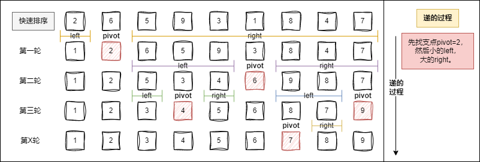
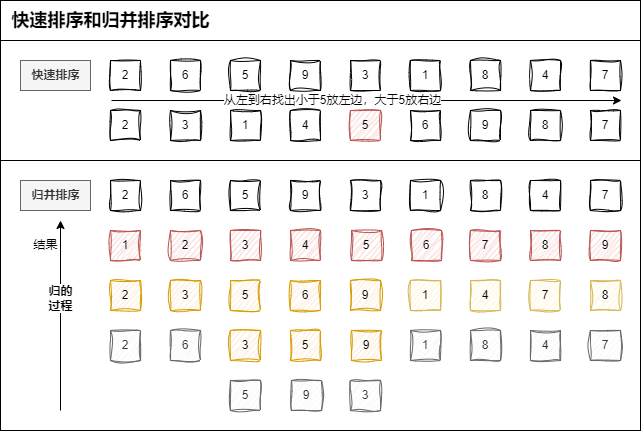
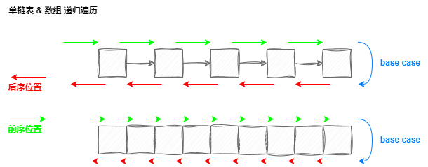

Day10.东哥手把手带你刷二叉树（纲领篇）

# 零、前言

## 更新日志：

> 2024-4-14：完成 零、前言 & 一、二叉树的重要性 & 二、深入理解前中后序 的总结。

## ⭐1.总结二叉树解题，两类思维模式

### 1）「遍历」的思维模式：

**是否可以通过遍历一遍二叉树得到答案？**

- 如果可以，用一个 traverse 函数配合外部变量来实现。

### 2）「分解问题」的思维模式：

**是否可以定义一个递归函数，通过子问题（子树）的答案推导出原问题的答案？**

- 如果可以，写出这个递归函数的定义，并充分利用这个函数的返回值。

## ⭐2.不管哪种思维，都要思考：

**如果单独抽出一个二叉树节点，它需要做什么事情？需要在什么时候（前/中/后序位置）做？**

- 其他的节点不用你操心，递归函数会帮你在所有节点上执行相同的操作。

## 3.本文讲解思路

1. 从最简单的问题中**提炼**出所有**二叉树**题目的**共性**

2. **升华**二叉树中蕴含的思维，

3. 用到 **动态规划，回溯算法，分治算法，图论算法** 中去，

4. **学习**了上述**高级算法**，**回头看**本文，有**更深刻**认识。

# 一、二叉树的重要性

## 1.深刻理解快速排序、归并排序：

**快速排序**： 二叉树的**前序**遍历
**归并排序**：二叉树的**后序**遍历

为什么？

### 1）我之前的思路

#### 1.1）快速排序

> 以下参考链接：[算法学习笔记 2](https://zhuanlan.zhihu.com/p/632914631)  
> 2.1 实现 快速排序  
> 思路：选一个支点 pivot（少宾），让左边都是小于 pivot 的，右边都是大于 pivot 的，递归，concat 连接。  
> 

#### 1.2）归并排序

> 以下参考链接：[算法学习笔记 2](https://zhuanlan.zhihu.com/p/632914631)  
> 2.2 实现 归并排序  
> 思路：之前的有序数组合并，得来新的有序数组。  
> 归并用的方法是合并两个有序数组。  
> 它也相当于一种**分治**，把一些问题拆解成了更小的问题，反向拆解问题，**归并排序是在归的阶段**（**快速排序是递的阶段**，这两个排序对比着看）。

#### 1.3）两者区别

> 以下参考链接：[算法学习笔记 2](https://zhuanlan.zhihu.com/p/632914631)  
> 2.3 快速排序 vs 归并排序，区别是什么？  
> 

> 快速排序：递的阶段  
> 归并排序：有序归来
>
> - 归并的主要方法，是递归地合并两个有序数组。

> 我理解的：
>
> - **先一层层向下递进搞了一堆 mergeSort 的 left、right，拆解成了一个个的小数组；**
> - **后来又在归的阶段，按大小顺序合并两个数组为有序的。**

### 2）快速排序

> 先**构造分界点**，然后去**左右子数组构造分界点**，你看这不就是一个二叉树的**前序**遍历吗？

#### 2.1）逻辑

若要对 `nums[left..right]` 进行排序，

1. 先找分界点 pivot，
2. 交换元素：  
   ① 让分界点左边都小于分界点值： `nums[left..pivot-1]` 都小于等于 `nums[pivot]`，  
   ② 且 `nums[pivot+1..right]` 都大于 `nums[pivot]`，
3. 然后递归地去寻找新的分界点：在 `nums[left..pivot-1]` 和 `nums[pivot+1..right]` 中，

最后整个数组就被排序了。

#### 2.2）代码框架

```js
var sort = function (nums, left, right) {
  /****** 前序遍历位置 ******/
  // 通过交换元素构建分界点 pivot
  var pivot = partition(nums, left, right)
  /************************/

  sort(nums, left, pivot - 1)
  sort(nums, pivot + 1, right)
}
```

### 3）归并排序

> 先对**左右子数组排序**，然后**合并**（**类似合并有序链表**的逻辑），你看这是不是二叉树的**后序**遍历框架？  
> 另外，这不就是传说中的**分治算法**嘛，不过如此呀。

#### 3.1）逻辑

若要对 nums[left..right] 进行排序，

1. 先对 nums[left..mid] 排序，
2. 再对 nums[mid+1..right] 排序，
3. 最后把这两个有序的子数组合并，

整个数组就排好序了。

#### 3.2）代码框架

```js
// 定义：排序 nums[left..right]
function sort(nums, left, right) {
  var mid = Math.floor((left + right) / 2)
  // 排序 nums[left..mid]
  sort(nums, left, mid)
  // 排序 nums[mid+1..right]
  sort(nums, mid + 1, right)

  /****** 后序位置 ******/
  // 合并 nums[left..mid] 和 nums[mid+1..right]
  merge(nums, left, mid, right)
  /*********************/
}
```

## 2.二叉树的算法思想，运用广泛

> **一眼识破**排序算法底细，不需要背经典算法吗 -> 手到擒来，**根据二叉树遍历框架扩展**出算法。  
> 题外话：我就喜欢不用背。

- 只要**涉及递归**，都可以**抽象成二叉树**的问题。

- 从二叉树的**前中后序开始，深刻理解**数据结构的魅力

# 二、深入理解前中后序

## 1.先思考 3 个问题：

> 1. 二叉树前、中、后序遍历 What？三个顺序不同的 List？
> 2. 后序遍历的特殊之处 What？
> 3. 多叉树没有中序遍历 Why？

## 2.二叉树遍历框架中的 traverse 函数 和遍历数组、链表本质上没有区别：

### 先总结：

首先：

1. 单链表和数组的遍历，可迭代，可递归，
2. 二叉树就是二叉链表，没办法简单改写成迭代形式，
3. 所以一般二叉树的遍历框架，都是递归形式。

其次：

- 只要递归形式的遍历，都有前序位置、后序位置，对应 递归前、递归后。

那么：

- 前序位置：刚进入一个节点（元素）的时候，
- 后序位置：即将离开一个节点（元素）的时候

最后：

- 代码的不同位置，对应 代码执行的不同时机，如图：



### 二叉树遍历框架

```js
var traverse = function (root) {
  if (root === null) {
    return
  }
  // 前序位置
  traverse(root.left)
  // 中序位置
  traverse(root.right)
  // 后序位置
}
```

### 遍历数组

#### 迭代：

```js
/* 迭代遍历数组 */
var traverse = function (arr) {
  for (var i = 0; i < arr.length; i++) {
    // Code block to be executed
  }
}
```

#### 递归：

```js
/* 递归遍历数组 */
var traverse = function (arr, i) {
  if (i == arr.length) {
    return
  }
  // 前序位置
  traverse(arr, i + 1)
  // 后序位置
}
```

### 遍历链表

#### 迭代：

```js
/* 迭代遍历单链表 */
var traverse = function (head) {
  for (var p = head; p != null; p = p.next) {
    // Code block to be executed
  }
}
```

#### 递归：

```js
/* 递归遍历单链表 */
var traverse = function (head) {
  if (head == null) {
    return
  }
  // 前序位置
  traverse(head.next)
  // 后序位置
}
```

## 3.举例：倒序打印单链表节点值，用递归的后序

> 实现方式有很多，  
> 对**递归**理解够**透彻**，利用**后序**位置：

```js
/* 递归遍历单链表，倒序打印链表元素 */
var traverse = function (head) {
  if (head === null) {
    return
  }
  traverse(head.next)
  // 后序位置
  console.log(head.val)
}
```

### 3.1.本质：递归的堆栈，实现倒序遍历

结合上图，得知此代码可以倒序打印单链表的原因：

- 本质上是**利用递归的堆栈**帮你**实现倒序遍历**的效果。

## 4.正确认识二叉树

> 二叉树只多中序位置。

### 1）浅层理解：三种顺序不同的 `List<Integer>` 列表

- 二叉树的前中后序只不过对应三种顺序不同的 `List<Integer>` 列表。

### 2）深入理解：

#### 2.1）三个特殊时间点

**前中后序**是遍历二叉树过程中**处理每一个节点**的**三个特殊时间点**，绝不仅仅是三个顺序不同的 List：

1. **前序**位置的代码在刚**刚进入**一个二叉树节点的时候**执行**；

2. **后序**位置的代码在**将要离开**一个二叉树节点的时候**执行**；

3. **中序**位置的代码在一个二叉树节点**左子树都遍历完，即将开始遍历右子树**的时候**执行**。

#### 2.2）前中后序「位置」 VS 前中后序「遍历」

在前序「位置」`list.push(item)` 或者写更复杂的逻辑，得到的就是前序「遍历」结果。

##### 画成图：

> 声明：图片来自 [labuladong 的算法笔记 —— Day10 东哥手把手带你刷二叉树（纲领篇）](https://labuladong.online/algo/challenge/part3/day10/#%E6%B7%B1%E5%85%A5%E7%90%86%E8%A7%A3%E5%89%8D%E4%B8%AD%E5%90%8E%E5%BA%8F)  
> 

不自己画了，手疼。。

#### 2.3）二叉树的每个节点都有「唯一」属于自己的前中后序位置

每个节点都有「唯一」属于自己的前中后序位置，所以是三个特殊时间点

#### 2.4）多叉树没有中序位置的原因：

二叉树唯一一次左右子树切换，多叉树多次切换子树：

因为：

- **二叉树**的每个节点只会进行**唯一一次**左子树切换右子树，
- 而**多叉树**节点可能**有很多子节点**，会**多次切换子树**去遍历，

所以：

- 多叉树节点没有「唯一」的中序遍历位置。

### 3）二叉树的所有问题

二叉树的所有问题：

- 就是让你在**前中后序位置注入巧妙的代码逻辑**，去达到自己的目的，
- 你只需要**单独思考每一个节点做什么，其他不管，抛给二叉树遍历框架**，
- 递归所有节点，做相同操作。

对于 [图论算法基础](https://labuladong.online/algo/data-structure/graph-traverse/) ：

- 把二叉树的遍历框架扩展到了图，
- 并以遍历为基础实现了图论的各种经典算法，这是后话。

## 5.例题：二叉树的前中后序遍历（94 144 145）

【二叉树题解】
已知二叉树的根节点 root
返回节点值的前、中、后序遍历

`TreeNode`：

```js
/**
 * Definition for a binary tree node.
 * function TreeNode(val, left, right) {
 *     this.val = (val===undefined ? 0 : val)
 *     this.left = (left===undefined ? null : left)
 *     this.right = (right===undefined ? null : right)
 * }
 */
/**
 * @param {TreeNode} root
 * @return {number[]}
 */
// code...
```

### 94.中序

> [94. 二叉树的中序遍历](https://leetcode.cn/problems/binary-tree-inorder-traversal/description/)

```js
/**
 * @param {TreeNode} root
 * @return {number[]}
 */
var inorderTraversal = function (root) {
  // 回溯算法思想
  const res = []
  const inOrder = function (node) {
    if (!node) return
    inOrder(node.left)
    res.push(node.val)
    inOrder(node.right)
  }
  inOrder(root)
  return res
}
```

### 144.前序

> [144. 二叉树的前序遍历](https://leetcode.cn/problems/binary-tree-preorder-traversal/description/)

```js
var preorderTraversal = function (root) {
  // 回溯算法思想
  let res = []
  const preOrder = function (node) {
    if (!node) return
    res.push(node.val)
    preOrder(node.left)
    preOrder(node.right)
  }
  preOrder(root)
  return res
}
```

```js
var preorderTraversal = function (root) {
  let res = []
  if (root == null) {
    return res
  }
  root.val ? res.push(root.val) : ''

  const left = preorderTraversal(root.left)
  // console.log(39, left);
  res = res.concat(left)
  // console.log(res);

  const right = preorderTraversal(root.right)
  // console.log(42, right);
  right.length != 0 ? (res = res.concat(right)) : ''

  return res
}
let root = { val: 1, left: null, right: { val: 2, left: { val: 3 } } },
  root2 = {},
  root3 = { val: 1 },
  root4 = { val: 1, left: { val: 2 } },
  root5 = { val: 1, left: null, right: { val: 2 } }
let res = preorderTraversal(root),
  res2 = preorderTraversal(root2),
  res3 = preorderTraversal(root3),
  res4 = preorderTraversal(root4),
  res5 = preorderTraversal(root5)
console.log(res, res2, res3, res4, res5)
```

### 145.后序

> [145. 二叉树的后序遍历](https://leetcode.cn/problems/binary-tree-postorder-traversal/description/)

```js
var postorderTraversal = function (root) {
  // 回溯算法思想
  const res = []
  const postOrder = function (node) {
    if (!node) return
    postOrder(node.left)
    postOrder(node.right)
    res.push(node.val)
  }
  postOrder(root)
  return res
}
```

# 三、两种解题思路<span style="color:red;">【to do】</span>

## 104.二叉树的最大深度

> [104. 二叉树的最大深度](https://leetcode.cn/problems/maximum-depth-of-binary-tree/description/)

## 1.读懂题目：

【二叉树题解】
给定二叉树
返回它的最大深度

## 2.写出思路：

- 二叉树题目的递归解法分两类思路： 1.遍历二叉树计算答案的思路。 2.分解问题计算答案的思路。
- 这两类思路分别对应： 1.回溯算法核心框架。 2.动态规划核心框架。

## 3.代码实现： maxDepth

### 3.1 遍历二叉树计算答案的思路

```js
/**
 * Definition for a binary tree node.
 * function TreeNode(val, left, right) {
 *     this.val = (val===undefined ? 0 : val)
 *     this.left = (left===undefined ? null : left)
 *     this.right = (right===undefined ? null : right)
 * }
 */
// --------------------1.遍历二叉树计算答案的思路 start【56ms】
/**
 * @param {TreeNode} root
 * @return {number}
 */
// 主函数
var maxDepth = function (root) {
  // 记录最大深度
  let res = 0
  // 记录遍历到的节点的深度
  let depth = 0
  // 二叉树遍历框架
  function traverse(root) {
    if (root == null) {
      return
    }
    // 前序位置
    depth++
    if (root.left == null && root.right == null) {
      // 到达叶子节点，更新最大深度
      res = Math.max(res, depth)
    }
    traverse(root.left)
    traverse(root.right)
    // 后序位置
    depth--
  }
  traverse(root)
  return res
}
// 问题：为什么在前序位置增加depth & 后序位置减少depth？
// 前序位置进入节点，后序位置离开节点，depth 记录当前递归到的节点深度，
// 把 traverse 理解成在二叉树上游走的一个指针，所以当然要这样维护。
// res 的更新，放在前中后序位置都可以，只要保证进入节点之后，离开节点之前（即depth自增之后，自减之前）就行。
// --------------------1.遍历二叉树计算答案的思路 end
```

### 3.2 分解问题计算答案的思路

```js
// --------------------2.分解问题计算答案的思路 start【72ms】
/**
 * Definition for a binary tree node.
 * function TreeNode(val, left, right) {
 *     this.val = (val===undefined ? 0 : val)
 *     this.left = (left===undefined ? null : left)
 *     this.right = (right===undefined ? null : right)
 * }
 */
/**
 * @param {TreeNode} root
 * @return {number}
 */
var maxDepth = function (root) {
  if (root == null) {
    return 0
  }
  // 利用定义，计算左右子树的最大深度
  let leftMax = maxDepth(root.left)
  let rightMax = maxDepth(root.right)
  // 整棵树的最大深度等于左右子树的最大深度取最大值
  // 然后再加上根节点自己
  let res = Math.max(leftMax, rightMax) + 1

  return res
}
// 问题：明确递归函数定义，这个解法就好理解了。但为什么主要代码逻辑集中在后序位置？
// 因为 通过子树最大高度推导出原树的高度，
// 所以当然要首先利用递归函数的定义算出左右子树的最大深度，
// 然后推出原树的最大深度，主要逻辑自然放在后序位置。
// --------------------2.分解问题计算答案的思路 end
```

## 4.测试用例：

```js
let tree = {
  val: 3,
  left: { val: 9 },
  right: { val: 20, left: { val: 15 }, right: { val: 7 } }
}
let result = maxDepth(tree)
console.log(result)
```

# 四、后序位置的特殊之处

## 543.二叉树的直径

> [543. 二叉树的直径](https://leetcode.cn/problems/diameter-of-binary-tree/description/)

## 1.读懂题目：

【二叉树题解-二叉树的直径】

二叉树的直径：
任意两结点 路径长度中的 最大值，
可能 穿过/不穿过 根结点。

### 注意：

两结点之间的路径长度是以它们之间边的数目表示。

## 2.写出思路：

### 二叉树题目的递归解法分两类思路：

1.遍历二叉树计算答案的思路。 2.分解问题计算答案的思路。

### 这两类思路分别对应：

1.回溯算法核心框架。

2.动态规划核心框架。

### 注意：

遇到子树问题，
首先想到给函数设置返回值，然后在后序位置做文章。
反过来，如果你写出了类似一开始的那种递归套递归的解法，
大概率也需要反思是不是可以通过后序遍历优化。

## 3.代码实现： diameterOfBinaryTree

```js
/**
 * Definition for a binary tree node.
 * function TreeNode(val, left, right) {
 *     this.val = (val===undefined ? 0 : val)
 *     this.left = (left===undefined ? null : left)
 *     this.right = (right===undefined ? null : right)
 * }
 */
/**
 * @param {TreeNode} root
 * @return {number}
 */

var diameterOfBinaryTree = function (root) {
  let maxDiameter = 0
  function maxDepth(root) {
    if (root == null) {
      return 0
    }
    // 利用定义，计算左右子树的最大深度
    let leftMax = maxDepth(root.left)
    let rightMax = maxDepth(root.right)

    // 后序位置，顺便计算最大直径
    let myDiameter = leftMax + rightMax
    maxDiameter = Math.max(maxDiameter, myDiameter)

    // 整棵树的最大深度等于左右子树的最大深度取最大值
    // 然后再加上根节点自己
    let res = Math.max(leftMax, rightMax) + 1

    return res
  }
  maxDepth(root)
  return maxDiameter
}
```

## 4.测试用例：

```js
let root = {
  val: 1,
  left: { val: 2, left: { val: 4 }, right: { val: 5 } },
  right: { val: 3 }
}
let res = diameterOfBinaryTree(root)
console.log(res) // 4-2-1-3 或 5-2-1-3
```

# 五、以树的视角看动归/回溯/DFS 算法的区别和联系

> []()

# 六、层序遍历

## 102.二叉树的层序遍历

> [102. 二叉树的层序遍历](https://leetcode.cn/problems/binary-tree-level-order-traversal/description/)

# 总结

Day10.东哥手把手带你刷二叉树（纲领篇）

## 更新日志：

> 2024-4-14：完成 零、前言 & 一、二叉树的重要性 & 二、深入理解前中后序 的总结。  
> 今天把前两个标题总结了，以及之前刷过的 leetcode 题解汇总在这儿，后续的再来几轮。  
> 程序员是个体力活，打字手指痛。。。  
> 今天的好多呀，之前的也不少，之前的以前刷过，并且整理下来了，今天的二叉树，可能以前偷懒了没有整理下来，只是在 PDF 上有笔记。

## 【收获 1】

【1】今天学习了 **二叉树算法思想**，以后遇到：

- [94. 二叉树的中序遍历](https://leetcode.cn/problems/binary-tree-inorder-traversal/description/)
- [144. 二叉树的前序遍历](https://leetcode.cn/problems/binary-tree-preorder-traversal/description/)
- [145. 二叉树的后序遍历](https://leetcode.cn/problems/binary-tree-postorder-traversal/description/)

类型的题目，我可以按照

二叉树前中后序：

- **res -> preOrder（先判空，再递归，在两个递归前中后位置写逻辑就是前中后序遍历） -> 执行 -> 返回 res**

的标准化步骤思考。

【2】还学习了 **递归** 思想，**数组和单链表如果用递归遍历**而不用迭代遍历，那就**相当于二叉树的前&后序思想**，比如，打卡文章总结里的 `二、深入理解前中后序` 里的 `2.二叉树遍历框架中的 traverse 函数 和遍历数组、链表本质上没有区别：` 里的 `举例：倒序打印单链表节点值，用递归的后序`，这个例子还有例子前面的图片，就说明了数组和单链表的前&后序递归遍历，而二叉树遍历就是多了中序遍历，而**二叉树就是二叉链表**，不过由于二叉树不能简单迭代遍历，所以二叉树都是递归遍历，只不过是平时使用的数组&单链表遍历经常使用迭代遍历，而忽略了它们之间的这种联系；

【3】今天主要学习的是递**归遍历的数组&单链表前&后序**，以及**递归遍历的二叉树前&中&后序**之间的区别与联系，这种把数据结构联系起来的数据结构**算法思想很重要**，为以后打下坚实的基础。

## 【收获 2】

今天输出了一篇打卡文章总结：

- [Day10.东哥手把手带你刷二叉树（纲领篇）](https://github.com/djsz3y/algorithm-labuladong/blob/master/Day10.东哥手把手带你刷二叉树（纲领篇）.md)

# 参考链接

- [LABULADONG 的算法网站](https://labuladong.online/algo/)
