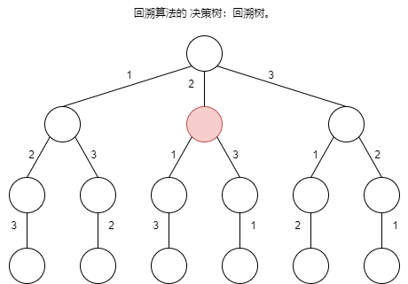
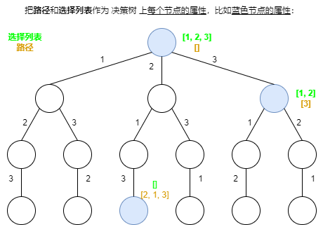
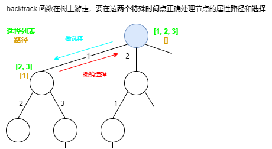

Day13.回溯算法解题套路框架

# 零、前言

## 更新日志：

> 2024-4-17：总结 前言 & 全排列问题，全排列还剩结尾部分，题目今天没有刷题，主要目标是前端面试的基础问题。

【1】本文**解决的问题**：

> 1. 回溯算法是什么？
> 2. 解决回溯算法相关的问题有什么技巧？
> 3. 如何学习回溯算法？
> 4. 回溯算法代码是否有规律可循？

【2】回溯算法**本质**

> 回溯算法，**类似于 DFS 算法**，**本质**就是一种**暴力穷举算法**。

【3】回溯算法 VS DFS 算法的**细微差别**是：

- 回溯算法是在遍历「树枝」，
- DFS 算法是在遍历「节点」

有个**简单印象**即可。

> 等**看**了 [东哥带你刷二叉树（纲领篇）](https://labuladong.online/algo/essential-technique/binary-tree-summary/) 和 [图论基础及遍历算法](https://labuladong.online/algo/data-structure/graph-traverse/) 就能**深刻理解**这句话的**含义**了。

【4】**抽象**地说，

> **解决一个回溯问题**，实际上就是**遍历一棵决策树的过程**，树的每个**叶子节点存放着一个合法答案**。你把**整棵树遍历一遍**，把**叶子节点上的答案都收集起来**，就能**得到所有的合法答案**。

【5】**在一个回溯树节点，思考 3 个问题**：

> 站在回溯树的一个节点上，你只需要思考 3 个问题：
> 1、「路径」：也就是已经做出的选择。
> 2、「选择列表」：也就是你当前可以做的选择。
> 3、「结束条件」：也就是到达决策树底层，无法再做选择的条件。

怎么理解？看后面的「全排列」和「N 皇后问题」

【6】回溯算法的**框架**：

Python

```py
result = []
def backtrack(路径, 选择列表):
    if 满足结束条件:
        result.add(路径)
        return

    for 选择 in 选择列表:
        做选择
        backtrack(路径, 选择列表)
        撤销选择
```

Python

```py
for 选择 in 选择列表:
    # 做选择
    将该选择从选择列表移除
    路径.add(选择)
    backtrack(路径, 选择列表)
    # 撤销选择
    路径.remove(选择)
    将该选择再加入选择列表
```

JavaScript

```js
const result = []
function backtrack(路径, 选择列表) {
  if (满足结束条件) {
    result.push(路径)
    return
  }

  for (选择 in 选择列表) {
    做选择
    backtrack(路径, 选择列表)
    撤销选择
  }
}
```

【7】**核心**

> 其核心就是 **for 循环里面的递归**，在**递归调用之前「做选择」，在递归调用之后「撤销选择」**，特别简单。

【8】做选择和撤销选择是什么？

详情见题目：全排列问题和 N 皇后问题。

## 上文回溯重点总结：

回溯算法是什么？

- 回溯算法类似于 DFS 算法，本质是暴力穷举算法。
- 解决回溯问题，就是一个决策树的遍历过程。

框架是：

```js

```

在回溯节点上，思考 3 个问题：

1. 「路径」：已经做出的选择。
2. 「选择列表」：当前可做的选择。
3. 「结束条件」：到达决策树底层，无法再做选择的条件。

# 一、全排列问题（46）

> 本次讨论 全排列问题**不包含重复的数字**，包含重复数字的扩展场景在后文 [回溯算法秒杀排列组合子集的九种题型](https://labuladong.online/algo/essential-technique/permutation-combination-subset-all-in-one/) 中讲解。

> 另外，有些读者之前看过的**全排列算法代码**可能是那种 **swap 交换元素**的写法，和我在本文介绍的代码不同。这是**回溯算法两种穷举思路**，我会在**后文** [球盒模型：回溯算法穷举的两种视角](https://labuladong.online/algo/practice-in-action/two-views-of-backtrack-2/) 讲明白。现在还不适合直接跟你讲那个解法，你照着我的思路学习即可。

## 回溯算法在高中的应用

1. 高中 排列组合的题，n 个不重复的数，全排列共 `n!` 个，当时穷举全排列：固定第一位，固定第二位，固定第三位。
2. 这就是回溯算法。
3. 画出决策树：



## 回溯树——回溯算法「决策树」：

【1】为什么叫决策树？因为**在每个节点上都在做决策树**：

比如<span style="color:red;">红色节点</span>：

1. 可以选择 1，也可以选择 3；
2. 为什么只能选择 1 和 3？  
   ① 因为 2 这个**树枝在身后**，这个**选择之前做过**了，**全排列不允许重复使用数字**。

【2】回顾之前的思考，解答开头的 3 个名词：

1. <span style="color:green;">「路径」</span>：`[2]`，记录**已经做过的选择**；
2. <span style="color:orange;">「选择列表」</span>：`[1, 3]`，表示**当前可以做出的选择**；
3. 「结束条件」：**遍历到树的底层叶子节点**，这里也就是**选择列表为空**的时候。

【3】把<span style="color:green;">「路径」</span>和<span style="color:orange;">「选择列表」</span>作为决策树上每个节点的属性，比如下图列出了几个<span style="color:#6C8EBF;">蓝色节点的属性</span>：



【4】`backtrack` 函数就像指针在树上游走：

我们定义的 **backtrack 函数**其实**就像**一个**指针**，**在**这棵**树上游走**，同时要**正确维护每个节点的属性**，每**当走到树的底层叶子节点**，其「路径」就是一个全排列。

【5】如何遍历一棵树？

[1]之前 [学习数据结构的框架思维](https://labuladong.online/algo/essential-technique/abstraction-of-algorithm/) 写过：**各种搜索问题其实都是树的遍历问题**，

[2]**多叉树的遍历框架**就是这样：

```js
var traverse = function (root) {
  for (var i = 0; i < root.children.length; i++) {
    // 前序位置需要的操作
    traverse(root.children[i])
    // 后序位置需要的操作
  }
}
```

[3]其中，**多叉树**的前序和后序位置在 for 循环外面，**回溯**的前序和后序在 for 循环的里面：

> 是的，**DFS 算法的前序和后序位置应该在 for 循环外面**，不过回溯算法和 DFS 算法略有不同，**回溯算法中跑到 for 循环里面**，后文 [图论算法基础](https://labuladong.online/algo/data-structure/graph-traverse/) 会详细对比，这里可以**暂且忽略**这个问题。

【6】前序遍历和后序遍历是**两个很有用的时间点**，

- 前序遍历的代码在**进入某一个节点之前**的那个时间点执行，
- 后序遍历代码在**离开某个节点之后**的那个时间点执行。

【7】`backtrack` 函数在树上游走，要在这两个特殊时间点正确处理节点的属性「路径」和「选择」：



【8】这样就可以理解回溯算法的核心框架了：

- **在递归之前做出选择，在递归之后撤销刚才的选择，就能正确得到每个节点的选择列表和路径。**

## 全排列代码：

```js
// 见 46. 全排列 的 3.代码实现： permute
```

> [46. 全排列](https://leetcode.cn/problems/permutations/description/)

## 1.读懂题目：

- 不含重复数字的数组 nums
- 全排列
- 按任意顺序

## 2.写出思路：

见上述 回溯算法的框架

`nums = [1,2,3]`
`[[1,2,3],[1,3,2],[2,1,3],[2,3,1],[3,1,2],[3,2,1]]`

## 3.代码实现： permute

```js
/**
 * @param {number[]} nums
 * @return {number[][]}
 */
/* 主函数，输入一组不重复的数字，返回它们的全排列 */
var permute = function (nums) {
  const res = []

  // 记录「路径」
  const track = []
  // 「路径」中的元素会被标记为 true，避免重复使用
  const used = new Array(nums.length).fill(false)
  // 路径：记录在 track 中
  // 选择列表：nums 中不存在于 track 的那些元素（used[i] 为 false）
  // 结束条件：nums 中的元素全都在 track 中出现
  const backtrack = function (nums, track, used) {
    // 触发结束条件
    if (track.length == nums.length) {
      console.log(44, track)
      res.push([...track])
      return
    }

    for (let i = 0; i < nums.length; i++) {
      // 排除不合法的选择
      if (used[i]) {
        // nums[i] 已经在 track 中，跳过
        continue
      }
      // 做选择
      track.push(nums[i])
      used[i] = true
      // 进入下一层决策树
      backtrack(nums, track, used)
      // 取消选择
      track.pop()
      used[i] = false
    }
  }
  backtrack(nums, track, used)
  return res
}
```

## 4.测试用例：

```js
const nums = [1, 2, 3],
  result = permute(nums)
console.log(result)
const nums2 = [0, 1],
  result2 = permute(nums2)
console.log(result2)
const nums3 = [1],
  result3 = permute(nums3)
console.log(result3)
```

# 二、N 皇后问题（51 & 52）

## 51.N 皇后

> [51. N 皇后](https://leetcode.cn/problems/n-queens/description/)

## 52.N 皇后 II

> [52. N 皇后 II](https://leetcode.cn/problems/n-queens-ii/description/)

# 三、最后总结

# 总结

Day13.回溯算法解题套路框架

## 更新日志：

> 2024-4-17：总结 前言 & 全排列问题，全排列还剩结尾部分，题目今天没有刷题，主要目标是前端面试的基础问题。

## 【收获 1】

【1】今天学习了 **回溯算法解题套路框架** 技巧，以后遇到：

- [46. 全排列](https://leetcode.cn/problems/permutations/description/)

【2】类型的题目，我可以按照：

- 记住回溯框架，
- res track used

的标准化步骤思考。

【3】今天没做回溯题目，现在处于找工作期间，先把面试相关基础知识打好，之前面试考了数组和滑动窗口，主要是数组和滑动窗口部分是重点，不过，算法打卡还是要继续的，每天只学一小点，做好笔记，将来也能积攒成一大步。

## 【收获 2】

今天输出了一篇打卡文章总结：

- [Day13.回溯算法解题套路框架](https://github.com/djsz3y/algorithm-labuladong/blob/master/Day13.回溯算法解题套路框架.md)

# 参考链接

- [LABULADONG 的算法网站](https://labuladong.online/algo/)
