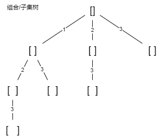
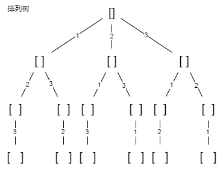
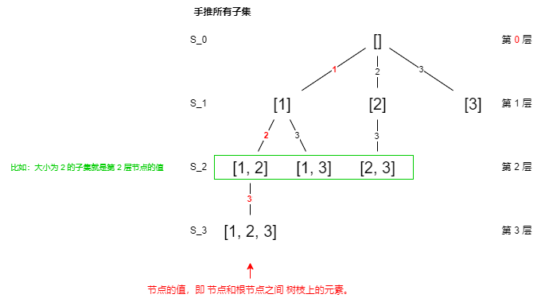

Day14.一文秒杀所有排列组合子集问题

# 零、前言

## 更新日志：

> 2024-4-18：总结 零、前言 & 子集（元素无重不可复选）。

## 1.本文主要内容：

> 高中学过排列、组合、子集系列问题，但是通过 编写算法解决它们，还是会 考验计算机思维。
> 本文主要内容为：编程解决这几个问题的**核心思路**，可能有变体，已不变应万变。

## ⭐2.排列、组合、子集问题 的几种变体

> 基本都是：从序列 nums 中以给定规则取若干元素。
> 基本形式有 3 种，所以共有 9 种变化。

### 【形式 1】<span style="color: red;">元素无重不可复选</span>

即 nums 中**元素都唯一**，每个元素最多**只能被使用一次**（最基本的形式）

- **以组合为例**，如果输入 `nums = [2,3,6,7]`，和为 7 的组合应该只有 `[7]`。

### 【形式 2】<span style="color: red;">元素可重不可复选</span>

即 nums 中的**元素可存在重复**，每个元素最多**只能被使用一次**。

- **以组合为例**，如果输入 `nums = [2,5,2,1,2]`，和为 7 的组合应该有两种 `[2,2,2,1]` 和 `[5,2]`。

### 【形式 3】<span style="color: red;">元素无重可复选</span>

即 nums 中的**元素都是唯一**的，每个元素**可被使用若干次**。

- **以组合为例**，如果输入 `nums = [2,3,6,7]`，和为 7 的组合应该有两种 `[2,2,3]` 和 `[7]`。

> 不用考虑第四种形式，即元素可重可复选。
>
> - 既然可复选，没必要存在重复元素。
> - 元素去重之后等同于形式 3。

## 3.衍生变体

添加各种限制条件：

> 比如让你求和为 target 且元素个数为 k 的组合，怪不得面试笔试中经常考到排列组合这种基本题型。

## ⭐4.本质

**穷举所有（呈现树形结构的）解。**

- 形式可以任意变化，只需要**合理使用回溯算法框架**，**稍改代码框架**即可一网打尽。

## ⭐5.解决所有排列、组合、子集相关问题的办法

1. 先阅读并**理解**前文 [回溯算法核心套路](https://labuladong.online/algo/essential-technique/backtrack-framework/)；
2. **记住**如下**子集问题和排列问题的回溯树**：

### 组合/子集树：



### 排列树：



## ⭐6.为什么能解决所有（只需记住两种树形结构）？

1. **组合问题和子集问题**其实是**等价**的，这个后面会讲；
2. **三种变化形式**，无非是在这**两棵树**上**剪掉或者增加一些树枝**罢了。

> 接下来开始穷举，把排列/组合/子集问题的 9 种形式都过一遍，学学如何用回溯算法把它们一套带走。

# 子集（元素无重不可复选）(78)【done】

> [78. 子集](https://leetcode.cn/problems/subsets/description/)

## 1.读懂题目：

- 输入：无重复元素的数组 nums
- 要求：每个元素最多使用一次
- 返回：nums 的所有子集
- 比如：输入 `nums = [1, 2, 3]`，返回如下子集：`[ [],[1],[2],[3],[1,2],[1,3],[2,3],[1,2,3] ]`。

## 2.写出思路：

### ⭐1）手推所有子集

> 暂时不考虑如何用代码实现，先回忆高中知识。

1. 生成 `S_0`（空集 []）：元素个数为 0 的子集。
2. 生成 `S_1`：元素个数为 1 的所有子集（在 `S_0` 基础上）。
3. 推导出 `S_2`：元素个数为 2 的所有子集（`S_1` 的基础上）。
4. 推出 `S_3`：只有一个集合 [1,2,3]（通过 `S_2`：[1,2] 推出的 ）。

### 2）其中，第 3 步，Why？

> 为什么集合 [2] 只需添加 3，而不添加前面的 1？

#### 2.1）因为：

- 集合中的元素**不考虑顺序**，[1,2,3] 中 2 后面只有 3，
- 如果你**添加**了**前面**的 1，那么 [2,1] 会**和之前**已经生成的子集 [1,2] **重复**。

#### ⭐2.2）换句话说：

- **保证**元素之间的**相对顺序不变**，来**防止**出现**重复的子集**。

### ⭐3）整个推导过程就是这样的树：



### ⭐4）注意这棵树的特性：

> 如果把**根节点**作为**第 0 层**，将每个**节点和根节点之间树枝上的元素**作为**该节点**的**值**，那么**第 n 层**的**所有节点**就是**大小为 n 的所有子集**。

#### 总结一下：

- 根节点作第 0 层，任一节点与根间 枝上的元素，作为这个任一节点的值；
- 第 n 层所有节点，就是大小为 n 的所有子集；

#### ⭐ 说白了：

1. 前提：第 0 层是根节点，树枝上是元素；
2. 某节点的值：该节点和根节点的枝上的所有元素；
3. 第 n 层：每个节点都有 n 个元素，大小/长度就是 n；
4. 那么第 n 层的所有节点的集合：就是大小为 n 的所有子集了；

### 5）举例：

比如：大小为 2 的子集就是第 2 层节点的值。

> 注意：之后所说「节点的值」都是：
>
> - 指**节点和根**节点之**间树枝上**的**元素**，
> - 且将**根**节点认为是**第 0 层**。

### ⭐6）计算所有子集：

> 想计算所有子集：
>
> - **遍历**这颗多叉树，
> - **收集**所有节点的值。

### 7）代码

```js
// 见 3.代码实现： subsets
```

### ⭐8）理解代码：

- ① 用 start 参数，控制树枝的生长，避免产生重复的子集，
- ② 用 track ，记录根节点到每个节点的路径值，
- ③ 前序位置，收集把每个节点的路径值，
- ④ 完成回溯树的遍历，就完成了所有子集的收集：

### ⭐9）backtrack 开头没有 base case，无限递归？

不会。当 `start == nums.length` 时，

- **叶子节点**的值会被**装入 res**，
- 但 **for** 循环**不会执行**，也就**结束**了**递归**。

## 3.代码实现： subsets

```js
/**
 * @param {number[]} nums
 * @return {number[][]}
 */
// 主函数
var subsets = function (nums) {
  const res = []

  // 记录回溯算法的递归路径
  const track = [] // ② 用 track ，记录根节点到每个节点的路径值，

  // 回溯算法核心函数，遍历子集问题的回溯树
  let backtrack = function (nums1, start) {
    // ① 用 start 参数，控制树枝的生长，避免产生重复的子集，

    // 前序位置，每个节点的值都是一个子集
    console.log(31, track)
    res.push([...track]) // ③ 前序位置，收集把每个节点的路径值，④ 完成回溯树的遍历，就完成了所有子集的收集：

    // 回溯算法标准框架
    for (let i = start; i < nums1.length; i++) {
      // 做选择
      track.push(nums1[i])

      // 通过 start 参数控制树枝的遍历，避免产生重复的子集
      backtrack(nums1, i + 1)

      // 撤销选择
      track.pop()
    }
  }

  backtrack(nums, 0)
  return res
}
```

## 4.测试用例：

```js
const nums = [1, 2, 3],
  result = subsets(nums)
console.log(result)
const nums2 = [0],
  result2 = subsets(nums2)
console.log(result2)
```

# 组合（元素无重不可复选）(77)【todo】

# 排列（元素无重不可复选）(46)

## 1.读懂题目：

返回全排列

## 2.写出思路：

```py
for 选择 in 选择列表:
 # 做选择
 将该选择从选择列表移除
 路径.add(选择)
 backtrack(路径, 选择列表)
 # 撤销选择
 路径.remove(选择)
 将该选择再加入选择列表
```

## 3.代码实现： permute

## 4.测试用例：

```js
/**
 * @param {number[]} nums
 * @return {number[][]}
 */
/* 主函数，输入一组不重复的数字，返回它们的全排列 */
var permute = function (nums) {
  let res = []

  // 记录「路径」
  let track = []
  // 「路径」中的元素会被标记为 true，避免重复使用
  let used = new Array(nums.length).fill(false)
  // 路径：记录在 track 中
  // 选择列表：nums 中不存在于 track 的那些元素（used[i] 为 false）
  // 结束条件：nums 中的元素全都在 track 中出现
  let backtrack = function (nums, track, used) {
    // 触发结束条件
    if (track.length == nums.length) {
      console.log(44, track)
      res.push([...track])
      return
    }

    for (let i = 0; i < nums.length; i++) {
      // 排除不合法的选择
      if (used[i]) {
        // nums[i] 已经在 track 中，跳过
        continue
      }
      // 做选择
      track.push(nums[i])
      used[i] = true
      // 进入下一层决策树
      backtrack(nums, track, used)
      // 取消选择
      track.pop()
      used[i] = false
    }
  }
  backtrack(nums, track, used)
  return res
}
const nums = [1, 2, 3],
  result = permute(nums)
console.log(result)
const nums2 = [0, 1],
  result2 = permute(nums2)
console.log(result2)
const nums3 = [1],
  result3 = permute(nums3)
console.log(result3)
```

# 子集/组合（元素可重不可复选）(90)

# 排列（元素可重不可复选）(47)

# 子集/组合（元素无重可复选）(39)

# 排列（元素无重可复选）(力扣上没有类似的题目)

# 最后总结

# 总结

Day14.一文秒杀所有排列组合子集问题

## 更新日志：

> 2024-4-18：总结 零、前言 & 子集（元素无重不可复选）。

## 【收获 1】

【1】今天学习了 **一文秒杀所有排列组合子集问题** 技巧，以后遇到：

- [78. 子集](https://leetcode.cn/problems/subsets/description/)

【2】类型的题目，我可以按照：

1. 记住回溯框架，
2. res track used，记住回溯树：组合/子集树 & 排列树。

的标准化步骤思考。

【3】今天做了一个项目的学习，之后做了算法 78 的整理。

## 【收获 2】

今天输出了一篇打卡文章总结：

- [Day14.一文秒杀所有排列组合子集问题](https://github.com/djsz3y/algorithm-labuladong/blob/master/Day14.一文秒杀所有排列组合子集问题.md)

# 参考链接

- [LABULADONG 的算法网站](https://labuladong.online/algo/)
