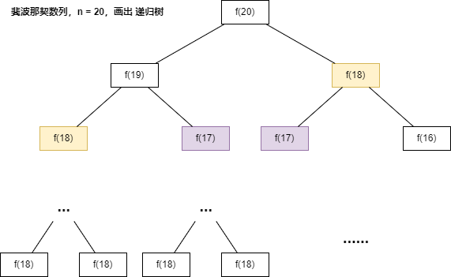

Day16.动态规划详解

# 零、前言

## 更新日志：

> 2024-4-20：阅读了 v5.2 的 一、斐波那契数列 的 PDF；总结了 零、前言 & 一、斐波那契数列 - 1、暴力递归。

## 1.本文主要内容：

> 希望本文成为解决动态规划的一部「指导方针」  
> 动态规划问题（Dynamic Programming）经常头疼，也是最具有技巧性，最有意思的。  
> 整整一个章节专门来写这个算法，动态规划的重要性也可见一斑。

本文解决几个问题：

1. 动态规划是什么？
2. 解决动态规划问题有什么技巧？
3. 如何学习动态规划？
4. **讲解**该算法的**基本套路框架**：

> 算法技巧就那几个套路，都在使用本文的解题框架思维，  
> 形成一套解决这类问题的思维框架，  
> 成为解决动态规划问题的一部指导方针。

## 2.基本套路框架

### 2.1.动态规划问题的一般形式

首先，动态规划问题的一般形式就是**求最值**。

1. **动态规划**其实是**运筹学**的一种**最优化方法**，
2. 只不过在**计算机问题上应用比较多**，比如说让你**求最长递增子序列**呀，**最小编辑距离**呀等等。

### 2.2.核心问题是什么？

> 既然是要求最值，核心问题是什么？

求解动态规划的核心问题是**穷举**。

- 因为要**求最值**，肯定要把所有**可行的答案穷举出来**，然后在其中**找最值**呗。

## 3.基本套路框架-具体详细说明

> 虽然动态规划的**核心思想**就是**穷举求最值**，
> 但是问题可以千变万化，穷举所有可行解其实并不是一件容易的事，需要你

### 3.1.动态规划三要素

1. 重叠子问题、
2. 最优子结构、
3. 状态转移方程

① 只有列出**正确的「状态转移方程」**，

- **熟练掌握递归思维**，才能正确地穷举。

② 判断算法问题是否**具备「最优子结构」**，

- 是否能够通过**子问题的最值得到原问题的最值**。

③ 动态规划问题**存在「重叠子问题」**，

- 如果暴力穷举的话效率会很低，所以需要你**使用「备忘录」或者「DP table」来优化穷举过程**，避免不必要的计算。

### 3.2.思维框架

> 辅助思考「状态转移方程」，  
> 具体意思，**后面举例详解**，  
> 实际算法问题最困难的是：写出状态转移方程（动态规划问题困难的原因）。

```math
明确 base case -> 明确「状态」-> 明确「选择」 -> 定义 dp 数组/函数的含义。
```

## 4.按套路走后，解法代码框架

法 Ⅰ（自顶向下）

```py
# 自顶向下递归的动态规划
def dp(状态1, 状态2, ...):
    for 选择 in 所有可能的选择:
        # 此时的状态已经因为做了选择而改变
        result = 求最值(result, dp(状态1, 状态2, ...))
    return result
```

法 Ⅱ（自底向上）

```py
# 自底向上迭代的动态规划
# 初始化 base case
dp[0][0][...] = base case
# 进行状态转移
for 状态1 in 状态1的所有取值：
    for 状态2 in 状态2的所有取值：
        for ...
            dp[状态1][状态2][...] = 求最值(选择1，选择2...)
```

## 5.详解基本原理

下面通过**斐波那契数列问题**和**凑零钱问题**来**详解动态规划的基本原理**。

1. 前者主要是让你明白**什么是重叠子问题**（斐波那契数列没有求最值，所以严格来说不是动态规划问题），
2. 后者主要举集中于**如何列出状态转移方程**。

> 简单的例子才能把精力充分集中在算法背后的通用思想和技巧上，不会因为隐晦的细节问题而感到莫名其妙。

# 一、斐波那契数列

## 1、暴力递归

> 斐波那契数列的**数学形式**就是**递归**的

代码：

```js
var fib = function (N) {
  if (N === 1 || N === 2) return 1
  return fib(N - 1) + fib(N - 2)
}
```

### 简洁，但低效的原因

#### 【1】斐波那契数列，n = 20，**画出递归树**：

> 注意：
>
> - **遇到**需**递归**的问题，最好都画出**递归树**，
> - 对**分析算法的复杂度 & 寻找算法低效的原因**有巨大帮助。



#### 【2】递归树的理解

> - 想要**计算原问题** `f(20)`，我就得**先计算出子问题** `f(19)` 和 `f(18)`，
> - 然后要**计算 `f(19)`**，我就要**先算出子问题** `f(18)` 和 `f(17)`，
> - **以此类推**。
> - **最后遇到 `f(1)` 或者 `f(2)`** 的时候，**结果已知**，就能**直接返回结果**，**递归树不再向下生长**了。

打卡的读者，我，**总结一下**：

1. 要想计算原问题，就得先计算出子问题，
2. 要想计算子问题，就得先计算出子问题的子问题，
3. 以此类推
4. 最后遇到基本问题，结果已知，直接返回结果，递归树不再向下生长。

#### 【3】**递归算法的时间复杂度**

##### 1）**计算方法**：

- 用**子问题个数**乘以**解决一个子问题需要的时间**。

##### 2）计算本题：

[1]首先，计算**子问题个数**，即**递归树中节点的总数**。

- 显然**二叉树节点总数为指数级别**，所以子问题个数为 `O(2^n)`。

[2]然后，计算**解决一个子问题的时间**，

- 在本算法中，**没有循环**，只有 `f(n - 1) + f(n - 2)` **一个加法操作**，时间为 `O(1)`。

[3]所以，**二者相乘**是本题的算法的时间复杂度，即 `O(2^n)`，**指数级别，爆炸**。

#### 【4】算法低效的原因

> 观察递归树，很明显发现了算法低效的原因：

[1]**存在大量重复计算**，比如 `f(18)` 被**计算了两次**，而且你可以看到，以 `f(18)` 为根的这个递归树**体量巨大**，多算一遍，会**耗费巨大的时间**。

[2]更何况，**还不止** `f(18)` 这**一个节点被重复计算**，

[3]所以这个**算法及其低效**。

#### 【5】这就是

- **动态规划问题的第一个性质：重叠子问题**。
- 下面，我们**想办法解决**这个问题。

## 2、带备忘录的递归解法

## 3、dp 数组的迭代（递推）解法

## 例题：509.斐波那契数

> [509. 斐波那契数](https://leetcode.cn/problems/fibonacci-number/description/)

### 1.读懂题目：

F(0) = 0，F(1) = 1
F(n) = F(n - 1) + F(n - 2)，其中 n > 1
给定 n ，请计算 F(n) 。

### 2.写出思路：

### 3.代码实现： fib

```js
/**
 * @param {number} n
 * @return {number}
 */
var fib = function (n) {
  if (n == 0 || n == 1) {
    // base case
    return n
  }
  // 分别代表 dp[i - 1] 和 dp[i - 2]
  let dp_i_1 = 1,
    dp_i_2 = 0
  for (let i = 2; i <= n; i++) {
    // dp[i] = dp[i - 1] + dp[i - 2];
    let dp_i = dp_i_1 + dp_i_2
    // 滚动更新
    dp_i_2 = dp_i_1
    dp_i_1 = dp_i
  }
  return dp_i_1
}
```

### 4.测试用例：

```js
const n = 2,
  res = fib(n)
console.log(res)
const n2 = 3,
  res2 = fib(n2)
console.log(res2)
```

# 二、凑零钱问题

> [322. 零钱兑换](https://leetcode.cn/problems/coin-change/description/)

# 三、最后总结

**计算机解决问题其实没有任何特殊的技巧，它唯一的解决办法就是穷举**，穷举所有可能性。算法设计无非就是先思考“如何穷举”，然后再追求“如何聪明地穷举”。

# 总结

Day16.动态规划详解

## 更新日志：

> 2024-4-20：阅读了 v5.2 的 一、斐波那契数列 的 PDF；总结了 零、前言 & 一、斐波那契数列 - 1、暴力递归。

## 【收获 1】

【1】今天学习了 **动态规划详解** 技巧，以后遇到：

- [509. 斐波那契数](https://leetcode.cn/problems/fibonacci-number/description/)
- [322. 零钱兑换](https://leetcode.cn/problems/coin-change/description/)

【2】类型的题目，我可以按照 **动态规划三要素**：

1. 重叠子问题、
2. 最优子结构、
3. 状态转移方程

的标准化步骤思考。

【3】具体来说就是：

① 只有列出**正确的「状态转移方程」**，

- **熟练掌握递归思维**，才能正确地穷举。

② 判断算法问题是否**具备「最优子结构」**，

- 是否能够通过**子问题的最值得到原问题的最值**。

③ 动态规划问题**存在「重叠子问题」**，

- 如果暴力穷举的话效率会很低，所以需要你**使用「备忘录」或者「DP table」来优化穷举过程**，避免不必要的计算。

## 【收获 2】

今天输出了一篇打卡文章总结：

- [Day16.动态规划详解](https://github.com/djsz3y/algorithm-labuladong/blob/master/Day16.动态规划详解.md)

# 参考链接

- [LABULADONG 的算法网站](https://labuladong.online/algo/)
