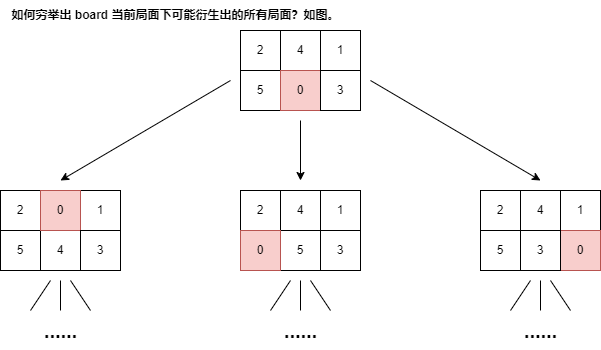
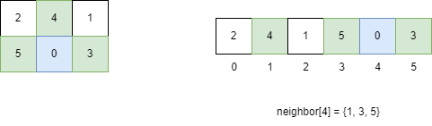

Day21.BFS-算法秒杀各种益智游戏

# 零、前言

## 更新日志：

> 2024-4-26：总结了 零、前言 & 一、算法框架。

## 本文主要内容：

[1]滑动拼图游戏

- `4 * 4` 的滑动拼图

- 一个空格子，移动其他数字，得到特定排列顺序。

- 也叫数字华容道。

[2]华容道的益智游戏

[3]游戏怎么玩呢？

1. 套路，类似于魔方还原公式（让人头秃的技巧），
2. **益智游戏** 用**暴力搜索算法**解决，学以致用，用 **BFS 算法框架**秒杀这些游戏。

# 一、题目解析（773. 滑动谜题）

> [773. 滑动谜题](https://leetcode.cn/problems/sliding-puzzle/description/)

## 1.读懂题目：

- `2 * 3` 的 板子，数字 1~5，数字 0 表示空缺，
- 移动数字 `board = [[1,2,3],[4,5,0]]` ，赢得游戏
- 写算法，最少移动次数，不能赢，返回 -1。

## 2.写出思路：

【1】**计算最小步数**的问题，我们就要**敏感**地想到 **BFS 算法**。

【2】此题转成 BFS 有技巧，面临如下问题：

1、一般的 BFS 算法：**从起点 start 向终点 target 寻路**，  
拼图问题不是在寻路，而是在**不断交换数字**，  
应该**怎么转化成 BFS** 算法问题呢？

2、**即便**问题**能转化**成 BFS，**如何处理起点 start 和终点 target**？它们**都是数组**，放进队列，套 BFS 框架，想想就**比较麻烦且低效**。

⭐【3】回答问题：

[1]怎么转化成 BFS？

- BFS 算法并不只是一个**寻路算法**，而是一种**暴力搜索算法**，只要**涉及暴力穷举**的问题，**BFS 就可以用**，而且可以**最快地找到答案**。

[2]计算机怎么解决问题的？

- 没有特殊技巧，本质上把**所有可行解暴力穷举**出来，**找最优解**。

【4】明白以上道理，问题就转化成：

如何**穷举出 board 当前局面下可能衍生出的所有局面**？

- **看数字 0 的位置**，和上下左右的数字进行**交换**即可：



【5】其实就是一个 BFS 问题：

- **每次先找到数字 0，和周围数字交换，形成新的局面加入队列**……
- 当**第一次到达 target** 时，就得到了**赢得游戏的最少步数**。

【6】对于第二个问题：

- board 仅仅是 **`2x3` 的二维数组**，所以可以**压缩成**一个**一维字符串**。
- **其中比较有技巧性的点在于，二维数组有「上下左右」的概念，压缩成一维后，如何得到某一个索引上下左右的索引？**

【7】直接手动写出映射，因为题目说输入的数组大小都是 `2x3`：

```js
// 记录一维字符串的相邻索引
var neighbor = [
  [1, 3],
  [0, 4, 2],
  [1, 5],
  [0, 4],
  [3, 1, 5],
  [4, 2]
]
```

【8】含义：

- 在**一维字符串**中，**索引 i 在二维数组**中的的**相邻索引为 `neighbor[i]`**：



...下次再继续写，我要看 TS 了 😄

## 3.代码实现：

## 4.测试用例：

# 二、思路分析

# 总结

Day21.BFS-算法秒杀各种益智游戏

## 更新日志：

> 2024-4-26：总结了 零、前言 & 一、算法框架。

## 【收获 1】

【1】今天学习了 **BFS-算法秒杀各种益智游戏** 技巧，

今天没有做题，但是了解到：

- 滑动拼图这种益智类游戏，使用暴力搜索算法，BFS 算法秒杀所有题目。
- 只要涉及暴力穷举的问题，BFS 就可以用，而且最快找到答案。

## 【收获 2】

今天输出了一篇打卡文章总结：

- [Day21.BFS-算法秒杀各种益智游戏](https://github.com/djsz3y/algorithm-labuladong/blob/master/Day21.BFS-算法秒杀各种益智游戏.md)

# 参考链接

- [LABULADONG 的算法网站](https://labuladong.online/algo/)
