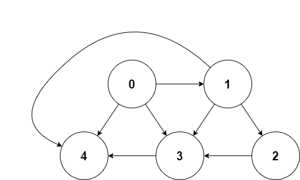

Day22.图论算法基础

# 零、前言

## 更新日志：

> 打卡又隔了一天。。。要加油，还有 8 天，再坚持 8 天。
> 2024-4-28：总结了 零、前言 & 图的逻辑结构和具体实现。

## 本文主要内容：

1.

# 一、图的**逻辑结构**和具体实现

（图的逻辑节点和具体实现：）

「图」这种数据结构：

- [学习数据结构和算法的框架思维](https://labuladong.online/algo/essential-technique/abstraction-of-algorithm/)
- 虽然**图**可以玩出更多的算法，**解决更复杂的问题**，但**本质上图**可以认为是**多叉树的延伸**。

**面试笔试很少出现图**相关的问题，就算有，大多是**简单的遍历问题**，基本上可以**完全照搬多叉树的遍历**。

**只讲「图」最实用的、距离我们最近**的，让你心里对图有个直观的认识，文末我给出了**其他经典图论算法**，理解本文后应该都可以拿下的。

## 1.构成：节点和边

一幅图是由**节点**和**边**构成的

## 2.逻辑结构：

为了方便研究，把图抽象成下图：



### 2.1 认为每个节点的实现如下：

Java

```java
/* 图节点的逻辑结构 */
class Vertex {
    int id;
    Vertex[] neighbors;
}
```

JavaScript

```js
/* 图节点的逻辑结构 */
var Vertex = function () {
  this.id = 0
  this.neighbors = []
}
```

### 2.2 和之前说的多叉树节点几乎完全一样：

Java

```java
// 基本的 N 叉树节点
class TreeNode {
  int val;
  TreeNode[] children;
}
```

JavaScript

```js
/* 基本的 N 叉树节点 */
var TreeNode = function () {
  this.val = null
  this.children = []
}
```

### 2.3 图 本质上就是个

高级点的多叉树，

适用于树的 DFS/BFS 遍历算法，全部适用于图。

## 3.用邻接表 & 邻接矩阵实现图：

「逻辑上的」图的实现，很少用 Vertex 类实现图，用邻接表 & 邻接矩阵。

### 3.1 用邻接表和邻接矩阵的存储方式如下：

#### 3.1.1 描述：

##### 1.邻接表：

每个节点 x 作为邻接表数组的 index，
节点 x 的邻居在列表里存着，
通过节点 x（找数组的 index）就可以找到所有邻居。

##### 2.邻接矩阵：

二维布尔数组 matrix，

###### 2.1 若节点 x 和 y 是相连，matrix[x][y] = true

###### 2.2 若想找节点 x 的邻居，扫一圈 matrix[x][..]

#### 3.1.2 代码：

```java
// 邻接表
// graph[x] 存储 x 的所有邻居节点
List<Integer>[] graph;

// 邻接矩阵
// matrix[x][y] 记录 x 是否有一条指向 y 的边
boolean[][] matrix;
```

#### 3.1.3 优势：

##### 1.邻接表（使用更频繁，操作更简单）：

占用空间少（邻接矩阵空位置多，需要更多存储空间）：
邻接表无法快速判断两个节点相邻，邻接表需要看 1 对应的邻居列表里 3 是否存在。

##### 2.邻接矩阵：

可以快速判断两个节点是否相邻，
即：matrix[1][3] true or false，效率高。

### 3.2 上面（有向无权图）衍生更复杂图模型（加权图，无向图，等等）：

#### 3.2.1 引入概念：度(每个节点相连的边的条数)：

边有方向（度分为入度、出度）。

#### 3.2.2 有向加权图：

#### 3.2.2.1 描述：

##### 1.邻接表：

不仅存节点 x 的所有邻居，还存 x 到每个邻居的权重，邻接表就实现了：加权有向图。

##### 2.邻接矩阵：

matrix[x][y] 的值，
由布尔值变成 int 值(0:没有连接，其他值:权重)，邻接矩阵就实现了：加权有向图。

#### 3.2.2.2 代码：

```java
// 邻接表
// graph[x] 存储 x 的所有邻居节点以及对应的权重
List<int[]>[] graph;

// 邻接矩阵
// matrix[x][y] 记录 x 指向 y 的边的权重，0 表示不相邻
int[][] matrix;
```

#### 3.2.3 无向图(无向<=>双向)：

无向图节点 x 和 y： 1.邻接表：x 邻居列表，加 y;y 邻居列表，加 x。 2.邻接矩阵：`matrix[x][y] = matrix[y][x] = true`

# 二、图的遍历

多叉树的 DFS 遍历框架：

```java
// 多叉树遍历框架
void traverse(TreeNode root) {
  if (root == null) return;
  // 前序位置
  for (TreeNode child : root.children) {
      traverse(child);
  }
  // 后序位置
}
```

图和多叉树最大区别：

- 图可能包含环（图的某节点，走一圈，又回原节点）（树的某节点，出发必走到叶子）。
- 图遍历框架要 visited 数组辅助（有环）：

```java
// 记录被遍历过的节点
boolean[] visited;
// 记录从起点到当前节点的路径
boolean[] onPath;

// 图遍历框架
void traverse(Graph graph, int s) {
  if (visited[s]) return;
  // 经过节点 s，标记为已遍历
  visited[s] = true;
  // 做选择：标记节点 s 在路径上
  onPath[s] = true;
  for (int neighbor : graph.neighbors(s)) {
      traverse(graph, neighbor);
  }
  // 撤销选择：节点 s 离开路径
  onPath[s] = false;
}
```

- 类比贪吃蛇游戏，
  visited 记录蛇经过过的格子，而 onPath 仅仅记录蛇身。
  在图的遍历过程中，
  onPath 用于判断是否成环，类比当贪吃蛇自己咬到自己（成环）的场景。
- 处理路径相关的问题，onPath 肯定被用到，比如 拓扑排序。
  onPath 数组的操作像回溯算法核心套路 中做「做选择」和「撤销选择」，
  区别在于位置：
  回溯算法的「做选择」和「撤销选择」在 for 循环里面，
  而对 onPath 数组的操作在 for 循环外面。
- 这就是前文 回溯算法核心套路 中讲到的回溯算法和 DFS 算法的区别所在：
  回溯算法关注的不是节点，而是树枝。不信你看前文画的回溯树，我们需要在「树枝」上做选择和撤销选择：
  区别反应到代码上：

```java
// DFS 算法，关注点在节点
void traverse(TreeNode root) {
    if (root == null) return;
    printf("进入节点 %s", root);
    for (TreeNode child : root.children) {
        traverse(child);
    }
    printf("离开节点 %s", root);
}

// 回溯算法，关注点在树枝
void backtrack(TreeNode root) {
    if (root == null) return;
    for (TreeNode child : root.children) {
        // 做选择
        printf("从 %s 到 %s", root, child);
        backtrack(child);
        // 撤销选择
        printf("从 %s 到 %s", child, root);
    }
}
```

- 关注树枝，执行回溯算法（漏掉了根节点）的代码：

```java
void traverse(TreeNode root) {
    if (root == null) return;
    for (TreeNode child : root.children) {
        printf("进入节点 %s", child);
        traverse(child);
        printf("离开节点 %s", child);
    }
}
```

- 所以这里「图」的遍历用 DFS 算法，即把 onPath 的操作放到 for 循环外面，否则会漏掉记录起始点的遍历。

- visited 数组：
  （图可能有环）防止递归重复遍历同一节点，进死循环。
  题目指出图中不含环，visited 数组可省掉，基本是多叉树的遍历。

# 三、题目实践（797「所有可能路径」）

## 注意: Java 的语言特性：

因为 Java 传参是对象引用，
所以 res 添加 path 需要拷贝新列表，
否则结果中 res 的列表都是空。
JavaScript 同理，`res.add(new LinkedList<>(path));` 即 `res.push([...path]);`

# 四、总结：

- 笔试最常考图的遍历（和多叉树遍历框架非常类似）。
- 图 de 其他有趣算法：
  二分图判定，
  环检测和拓扑排序（编译器循环引用检测是类似算法），
  最小生成树，
  Dijkstra 最短路径算法 等等。

> [797. 所有可能的路径](https://leetcode.cn/problems/all-paths-from-source-to-target/description/)

## 1.读懂题目：

## 2.写出思路：

## 3.代码实现： allPathsSourceTarget

```js
/**
 * @param {number[][]} graph
 * @return {number[][]}
 */
var allPathsSourceTarget = function (graph) {
  const res = [] // 记录所有路径

  var path = [] // 维护递归过程中经过的路径

  const traverse = (graph, s, path) => {
    /* 图的遍历框架 */

    // console.log(212, "s 是图的 index", s);
    // console.log(213, "图中的节点 s 指向：", graph[s]);
    path.push(s) // 添加节点 s 到路径

    let n = graph.length
    if (s == n - 1) {
      // s 是图的结束点
      // 到达终点
      // console.log(220, "s 是图的最后一个 index", s);
      res.push([...path])
      // console.log(222, `第${res.length}条路径：`, path);
      // console.log(223, `第${res.length}个遍历的现在，的路径集合：`, res);
      // 可以在这直接 return，但要 removeLast 正确维护 path
      // path.pop();
      // return;
      // 不 return 也可以，因为图中不包含环，不会出现无限递归
    }

    // 递归每个相邻节点
    for (let v of graph[s]) {
      // console.log(232, `${s} 节点的相邻节点是：`, v);
      traverse(graph, v, path)
    }

    // 从路径移出节点 s
    path.pop()
  }

  traverse(graph, 0, path)

  // console.log(242, "迭代后的结果：", res);
  return res
}
```

## 4.测试用例：

```js
const graph = [[1, 2], [3], [3], []],
  result = allPathsSourceTarget(graph)
console.log(248, '测试用例1：result：', result)
const graph2 = [[4, 3, 1], [3, 2, 4], [3], [4], []],
  result2 = allPathsSourceTarget(graph2)
console.log(251, '测试用例2：result2：', result2)
```

# 总结

Day22.图论算法基础

## 更新日志：

> 打卡又隔了一天。。。要加油，还有 8 天，再坚持 8 天。昨天入职了哈哈。
> 2024-4-28：总结了 零、前言 & 图的逻辑结构和具体实现。

## 【收获 1】

【1】今天学习了 **图论算法基础** 技巧，

今天没有做题，但是了解到：

- 图论算法基础，图的逻辑结构和具体实现

## 【收获 2】

今天输出了一篇打卡文章总结：

- [Day22.图论算法基础](https://github.com/djsz3y/algorithm-labuladong/blob/master/Day22.图论算法基础.md)

# 参考链接

- [LABULADONG 的算法网站](https://labuladong.online/algo/)
